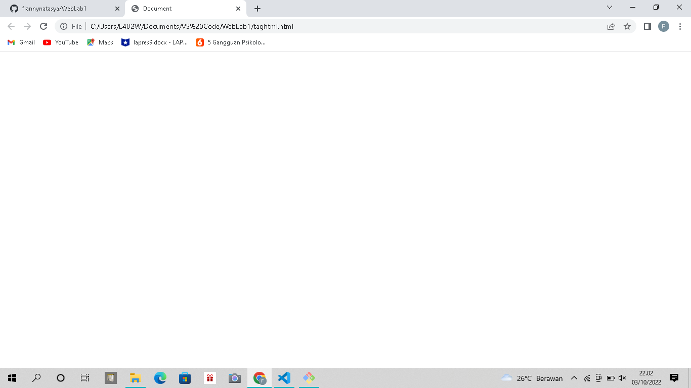
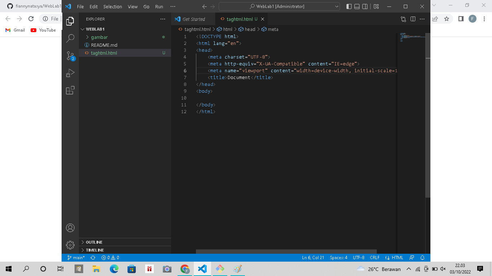
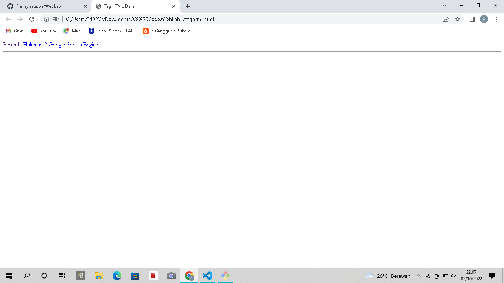
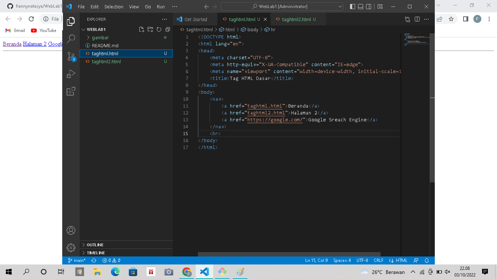
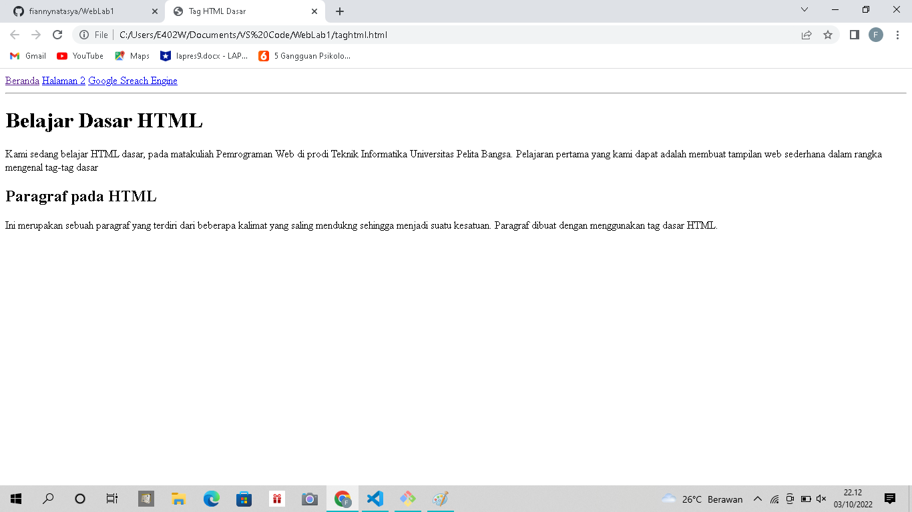
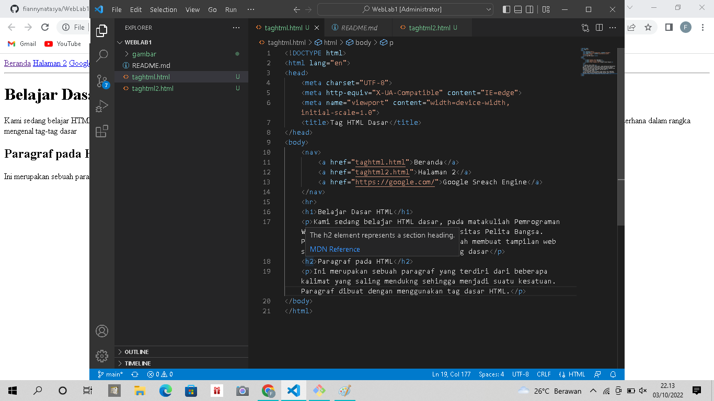
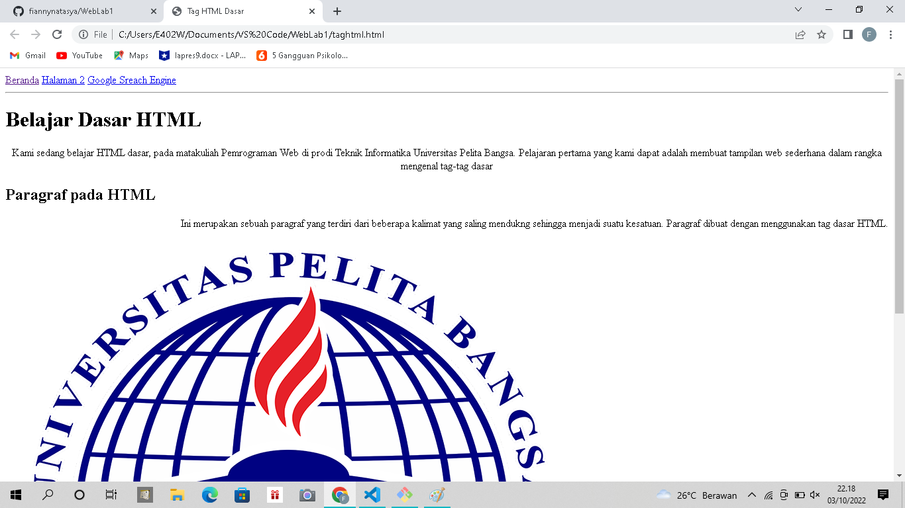
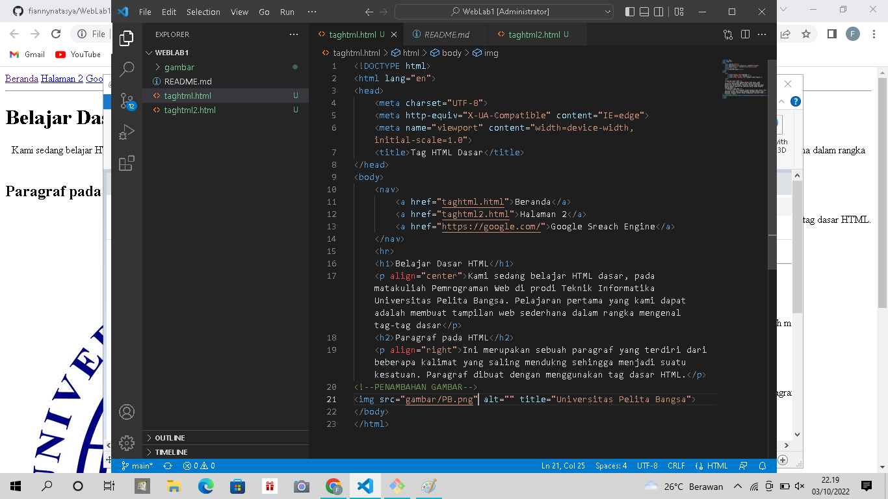
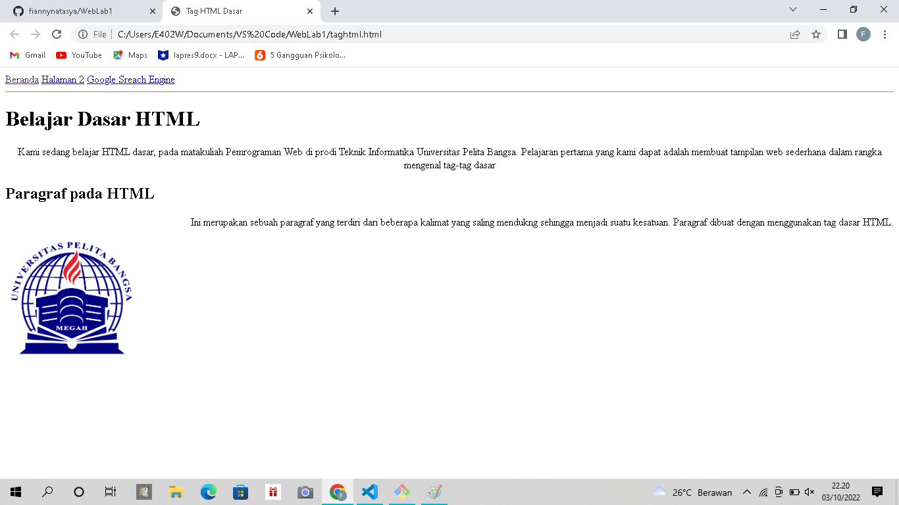
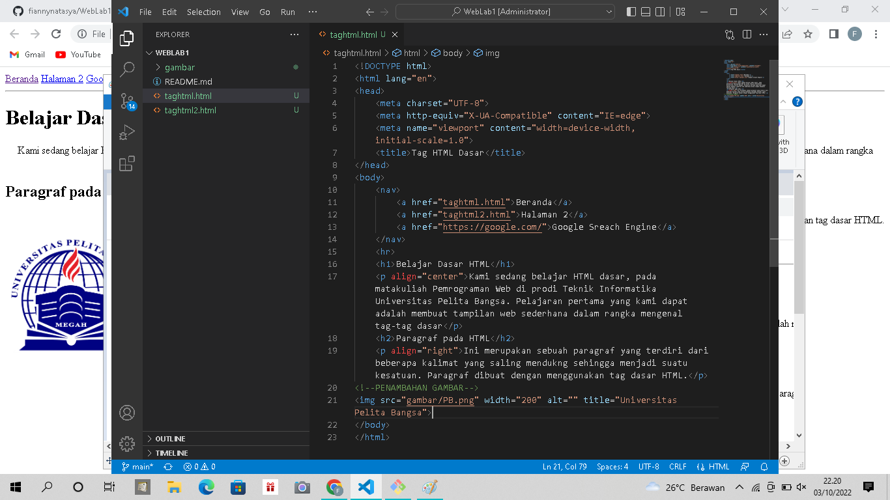

# WebLab1
## Praktikum HTML Dasar
### Perubahan Kode Dari HTML
perubahan ini menggunakan tag `
` degan contoh seperti
gambar dibawah 
1. Ini adalah gambaran awal tag dari HTML

dan diatas adalah kode dari tag html untuk awalan
dari tag `HTML`, `HEAD`, `BODY`

### Penggunaan navigasi bar
2. Penggunaan tag ini untuk membuat navigasi bar untuk user dengan
membuat link penghubung dengan direktori/ domain lainnya
seperti contoh gambar dibawah

### Pembuatan Paragraf untuk isian artikel
3. Pembuatan Paragraf ini menggunakan tag HTML dengan tag `
`
seperti gambar di bawah

### Perubahan Posisi text
4. Perubahan ini menggunakan tag HTML dengan style `align="center"` dan `align="right"`

seperti gambar dibawah

### Penambahan Gambar Pada HTML
5. Perubahan gambar dengan merubah ukuran dari gambar dengan menggunakan tag `width="200"`
seperti gambar di bawah

